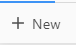
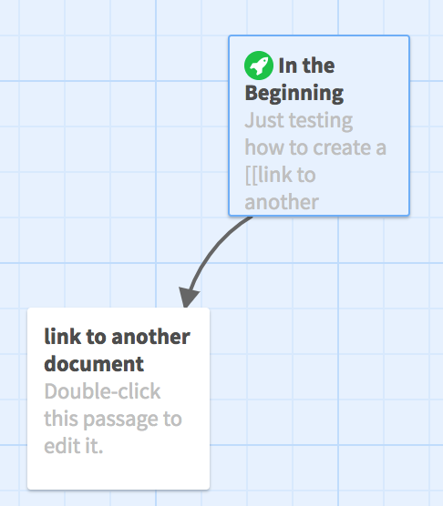
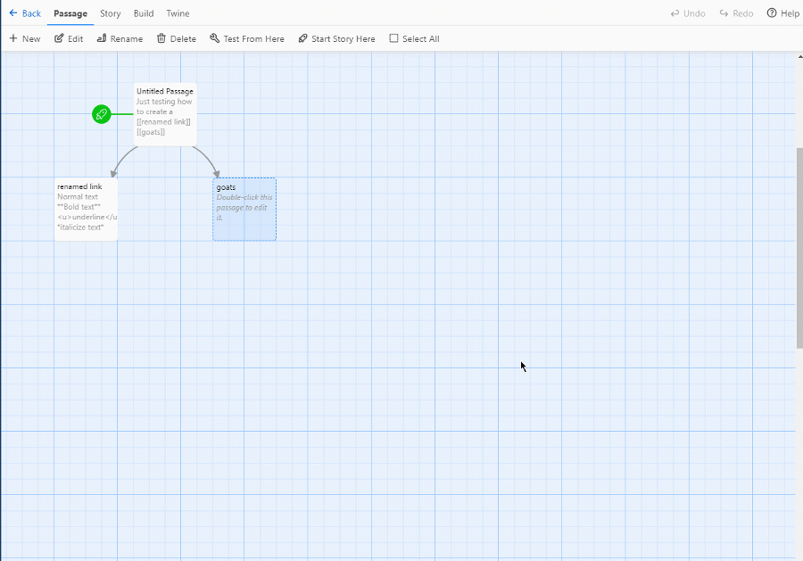
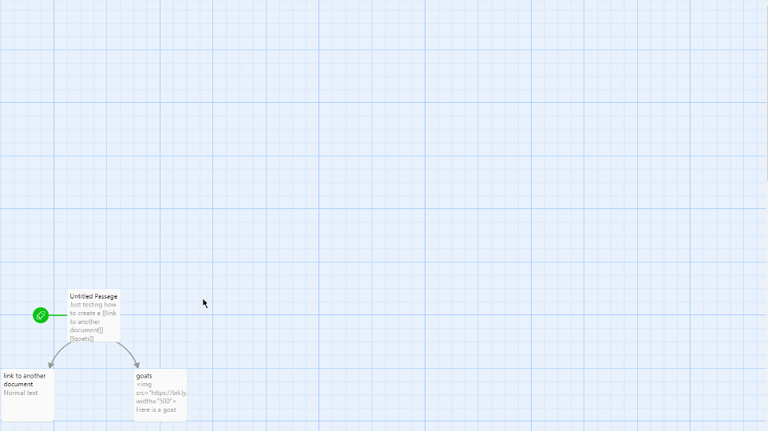
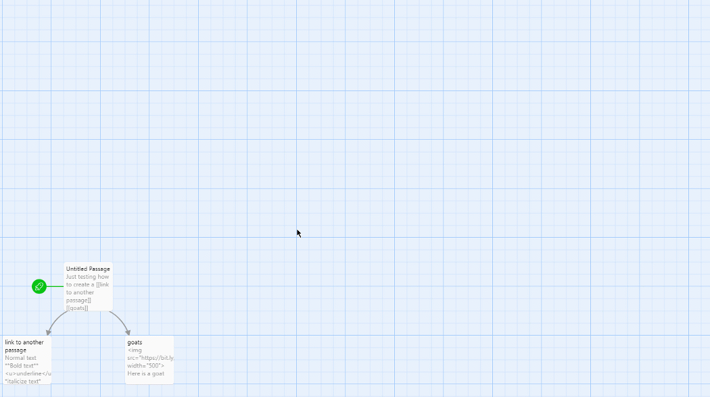
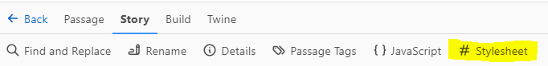
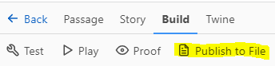

 
# Interactive, Nonlinear Stories with Twine: Getting Started
If you and your group have any questions or get stuck as you work through this in-class exercise, please ask the instructor for assistance.  Have fun!
**Note:** To avoid compatibility issues... 
**DO NOT use the SAFARI web browser on Macs!** 
Please use Firefox or Chrome web browsers instead of Safari.

1. Create a new story by navigating to [the Twine website](http://twinery.org/2/){:target="_blank"} and clicking on the “+New” button on the top navigation bar. Give your story a name something like, “In The Beginning” (which you can change later if you want to).
 
2. Open your word processing document where you have your story laid, or if you don’t have your own story you can [click here to use our Forest Adventure sample story](https://docs.google.com/document/d/12BeIFnMyKHyS0uQZbJxLBrIZ8lpEsUZ6vkjrj4gaLWE/edit?usp=sharing){:target="_blank"} which also contains a link to a live version of the story so you can test out an example of a Twine story. 
3. Double click on the “Untitled Passage” box on the screen and start importing your story into Twine by copying and pasting the first passage of text into the text box. Also title the passage, as this is key to linking different passages together. 
4.   To create other passages, simply surround the text in the document with double square brackets, and this automatically creates another passage. E.g.: **“Just testing how to create a [[link to another document]] in a story.”** Give this a try now if you haven’t already. You will see the auto-generated passage similar to the image to the right when you close the current passage.
5. Go ahead and create all the other passages for your story, by copy and pasting the text into passages as you just did above.  You can preview your story at any time by clicking the Build tab then clicking the Play button.
6. Next please insert an image into one of your passages by typing or pasting the following HTML into the passage. If you would like to use your own image, paste the URL of your own image in place of the URL below between the quotation marks: 
```

```

<button onclick="toggle('gif1')">Show / Hide Animation </button>
  <div id="gif1">
      
      </div> 


7. Experiment with different text types of formatting in a passage. 
    - Bold: This is done by putting two stars on either side of the text: ```**Bold text**```
    - Underline: Put the HTML tags for underline on either side of the text: ```<u>underline</u>```
    - Italicize: Put one star on either side of the text: ```*italicize text*```

    <button onclick="toggle('gif2')">Show / Hide Animation </button>
  <div id="gif2">
      
      </div> 


8. Rename one of the links (inside the double square brackets) in your first passage and see what happens.  
    - How can you fix it?
    - What happens when you change the title of one of your passages below your starting passage? This is how you change a link: by changing the title of the passage below it.

    <button onclick="toggle('gif3')">Show / Hide Animation </button>
  <div id="gif3">
      
      </div> 


9. Change the background colour, font type and font colour of your story by clicking on the Story tab and then clicking on Stylesheet.  
<br>

Now type in the following code:<br> 

```
tw-passage {
	font-family: arial;
  	color: black;
  	background-color: white;
	padding: 2em;
}
tw-icon {
	opacity: 1.0;
  	color: white;
}
tw-link {
	font-weight: normal;
}
```

10.  It’s important to remember to save your story fairly frequently as the story is being stored on your local hard drive. To do this, **click on the Build tab** and then **click on “Publish to File”**.  This will save the story to your local hard drive, and then you can email it to yourself or save it to a thumb drive for safekeeping.

11. To make your story and personal images publicly available on the internet, please follow the directions on our [Publish Your Twine Story on the Web Using GitHub Pages](github.html) activity.
    - Note: If you are using your own images, they must be available somewhere on the web, or also uploaded to your webspace with the correct filepath. The best practice is to upload them to your personal webspace as you develop your story so that you can make sure they work correctly as you go.<br>

12. **Extra Credit Activities (if you have time)**:<br> Put URL links to other webpages or web resources into your story. E.g. ```<a href="http://google.com">Link text here.</a>```

13.  Put URL links to other webpages or web resources into your story using an image as the link “button.” E.g. ```<a href="http://uvic.ca"></a>```

14.  To make your “display text” different from the name of the passage you want to link to, use this format for your link: ```[[Display Text|Text of passage title]]```  **Note: Make sure there are no extra spaces, and the case is identical for the passage title. **

15.  Embed a YouTube video into one of your passages. **Note in the code below how you need to modify the YouTube URL for this work by deleting the “watch?v=” from the URL and replacing it with “embed/” :**
```<iframe width="560" height="315" src="https://www.youtube.com/embed/JRY8TjB9d4U" frameborder="0" allowfullscreen></iframe>```
Here is a video that walks you through the process of embeding a video into a Twine Passage. 
<iframe width="560" height="315" src="https://www.youtube.com/embed/-mEQ6GBuTLU" title="YouTube video player" frameborder="0" allow="accelerometer; autoplay; clipboard-write; encrypted-media; gyroscope; picture-in-picture" allowfullscreen></iframe>

16. Add a coin flip or other random event to one of your passages so that the story branches to one of two different passages depending on the coin flip for example. Note: you can have more than two items for your random event.```(either:"[[heads]]","[[tails]]","[[The coin falls into the storm drain]]")```

17. Play some background audio in one of your passages:
```<audio autoplay loop>```
```<source src="https://archive.org/download/AzdaemaPodfic-SoundEffectsLibrary/Firefly%20themesong.mp3" type='audio/mpeg; codecs="mp3"'>```
```</audio>```

**Royalty-Free Media you can embed in your Twine stories:**
- Photos: 
    - [Unsplash](https://unsplash.com/){:target="_blank"}
    - [Pexels](https://www.pexels.com/royalty-free-images/){:target="_blank"} (also has video)
    - [Pixabay](https://pixabay.com/)
- Videos:
    - [YouTube](https://youtube.com){:target="_blank"}
    - [Vimeo](https://vimeo.com){:target="_blank"}
- Audio
  - [Internet Archive](https://archive.org/details/audio){:target="_blank"}

<script>  

    function toggle(input) {
        var x = document.getElementById(input);
        if (x.style.display === "none") {
            x.style.display = "block";
        } else {
            x.style.display = "none";
        }
    }
</script>

[NEXT STEP: Guided Interview](guided-interview.html){: .btn .btn-blue }
