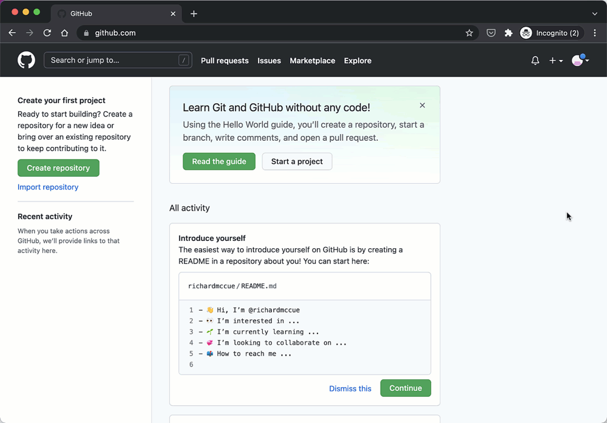
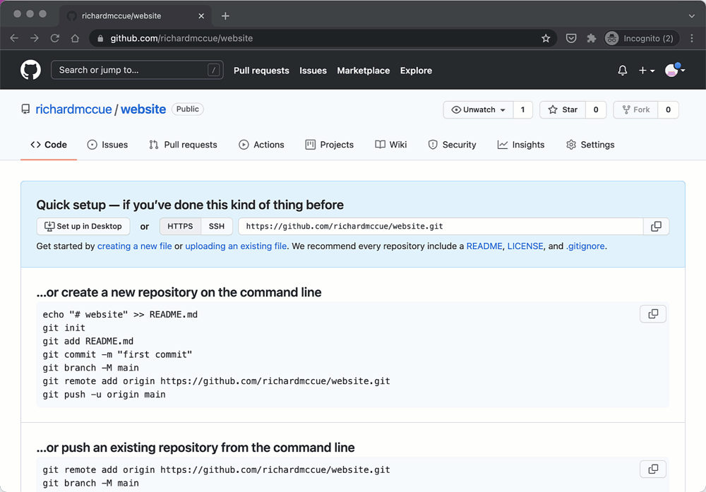
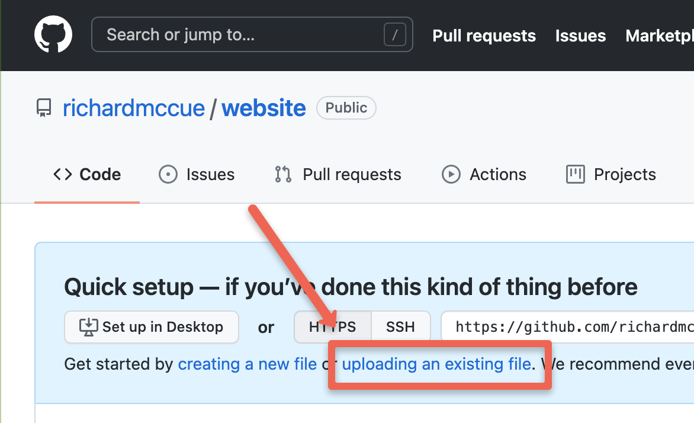
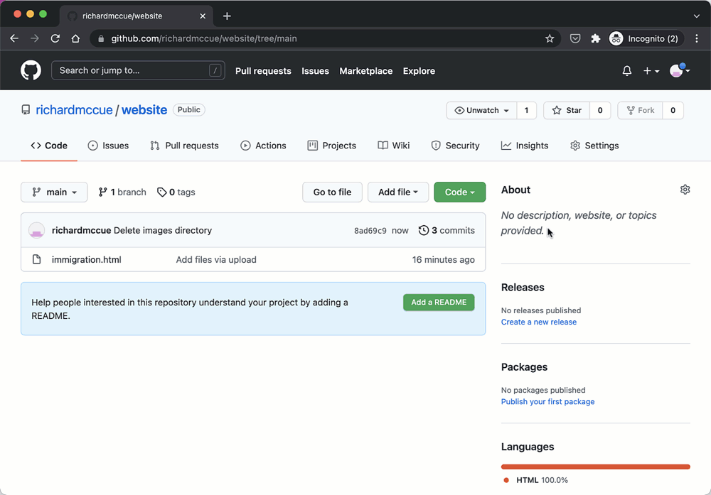
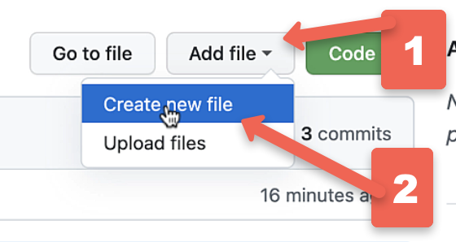
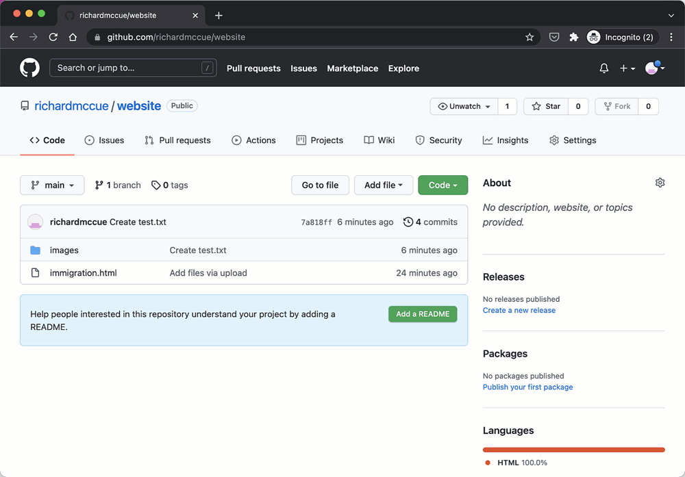
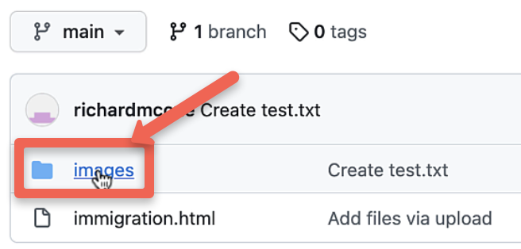
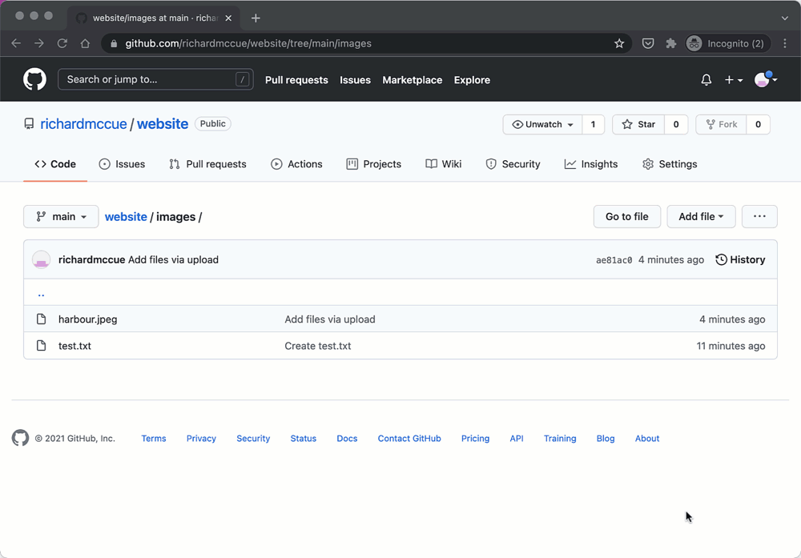

# Publish Your Twine Story or HTML Files on the Web Using GitHub Pages
If you and your group have any questions or get stuck as you work through this in-class exercise, please ask the instructor for assistance.  Have fun!

1. Signup for a GitHub Account (if you’d like you can watch this narrated video on YouTube of the [GitHub account creation process](https://youtu.be/ovCRBERA1NQ){:target="_blank"}):
  - Go to the [GitHub.com](https://github.com){:target="_blank"} website and click on the **Sign up** button on the top right of the web page. 
 
  - Enter your email address in the field provided. Press **Continue**.
  - Create a password for your GitHub account. Press **Continue**.
  - Enter a username to be associated with your email address. Press **Continue**. 
  - Note: Your username will be publicly visible, and your email address will not be publicly visible, so if you’d like a measure of anonymity, use a pseudonym for your user name.
  - If  you’d like GitHub product updates type “**y**” and press Continue, otherwise type “**n**” and press **Continue**.
  - Complete two puzzles to let GitHub know that you are a real person and not a bot, and then press **Create account**.
  - An 8-digit code will be sent to your email address. Please copy that code and paste in into the **Enter code** field.
  - Click on the **Just me** button, the **Student** button and then press **Continue**.
  - Click on the **Collaborative coding** check box, then scroll to the bottom of the page and press **Continue**.
  - Scroll to the bottom of the page and press **Continue for free**.
  - Congratulations, your account is setup!
2. Create a repository for your web pages (if you’d like you can watch this narrated video of how to [create a repository in your GitHub account](https://youtu.be/HhfPWwz8lVA){:target="_blank"}:
  - Click on the green **Create repository** button on the left side of the screen. 
 
  - Type the name you want to give your repository in the **Repository name** field. You can choose your own name, but if you can’t think of something, go ahead and type in “website”.
  - If you’d like your GitHub website to be publicly viewable leave the default setting, or change to Private if you’d prefer (you can change this in the future of course).
  - Click on the **Create repository** button.
  - Congratulations, you’ve created a repository to put your web pages in!
3. Upload your first Twine story or other files (if you’d like you can watch this narrated video of how to [upload your Twine story to GitHub](https://youtu.be/0FHgslaQnF4){:target="_blank"}:  
<iframe width="560" height="315" src="https://www.youtube.com/embed/0FHgslaQnF4" title="YouTube video player" frameborder="0" allow="accelerometer; autoplay; clipboard-write; encrypted-media; gyroscope; picture-in-picture" allowfullscreen></iframe> 
  - Rename your Twine file name to **index.html** or if you don’t see the “.html” file extension, just rename it, **index**. 
   
  - Click on the **upload an existing file** link. 
 
  - Click on the **choose your files** link.
  - Find your **index.html** or **index** file your local hard drive, and then **select** the file, and the press the **Open** button.
  - After the file finishes uploading, scroll to the bottom of the page, and click on the green **Commit changes** button.
  - Congratulations, you’ve uploaded your first file to your new GitHub repository!
4. Create an Images Directory to store photos in for your web page or twine story. This is necessary for personal photos that aren’t already publicly available on the web (if you’d like you can watch this narrated video of [how to create an image directory](https://youtu.be/FvCsnUgAdWA){:target="_blank"}:
  - Click on the **Add file** drop down menu. 
   
  - Then select **Create new file**. 
 
  - In the field that has **Name your file…** in grey text inside it, type: **images/test.txt** and then press the **Enter** key. 
 
 
  - Scroll to the bottom of the page and press the green **Commit new file** button.
  - Congratulations, you’ve created an images folder for your new GitHub repository!
5. Upload an image to your images folder in your GitHub repository (if you’d like you can watch this narrated video of how to [upload an image to your new image directory](https://youtu.be/ATVm6ACERu8){:target="_blank"}:
  - Note: **It is much easier for you as you create a GitHub website if you modify the file names for your images to make them short, descriptive, without spaces, and all lower case** (eg: “inner-harbour.jpg” instead of “Victoria Inner Harbour in the afternoon.jpg”). 
 
  - You should be in your images folder, but if you aren’t click on the **images** directory folder. 
 
  - Click on the **Add file** drop down menu.
  - Then select **Upload files**.
  - On the next webpage click on the blue **choose your files** link in the middle of the page and select an image file, or drag and drop your images into the middle of the page (remember that **your life will be easier if you rename your files before you upload them so that they are short, and don’t have any spaces in the file name** - eg: black-dog.jpg)
  - Scroll to the bottom of the page and press the green **Commit new file** button.
  - Repeat this process for each image file, or select multiple image files to upload them at the same time.
6. Enable GitHub Pages to make your website public (if you’d like you can watch this narrated video of [how to enable GitHub Pages](https://youtu.be/DqjPr7auwdY){:target="_blank"}:
  - Click on the **Settings** button on the top right of the webpage. 
       
  - On navigation menu on the left side of the screen, scroll down to the **Pages** button near the bottom of the menu and **click** on it.
  - Near the top of the webpage under the “Source” header, select the **None** drop down menu, then select **main**, and then click on the **Save** button.
  - Your new web address will be displayed on your page in the blue box (eg: https://richardmccue.github.io/website). It will take a few minutes before GitHub has     - created your website, so if you click on it an you get an error message wait at least 1 minute before trying again.
7. Great job on creating your first GitHub Pages website!

[NEXT STEP: Earn a Workshop Badge](informal-credentials.html){: .btn .btn-blue }

