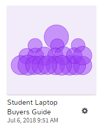
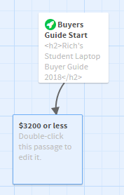
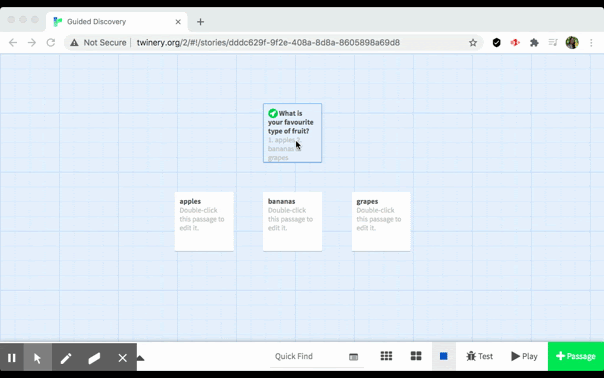
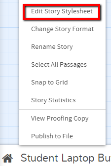
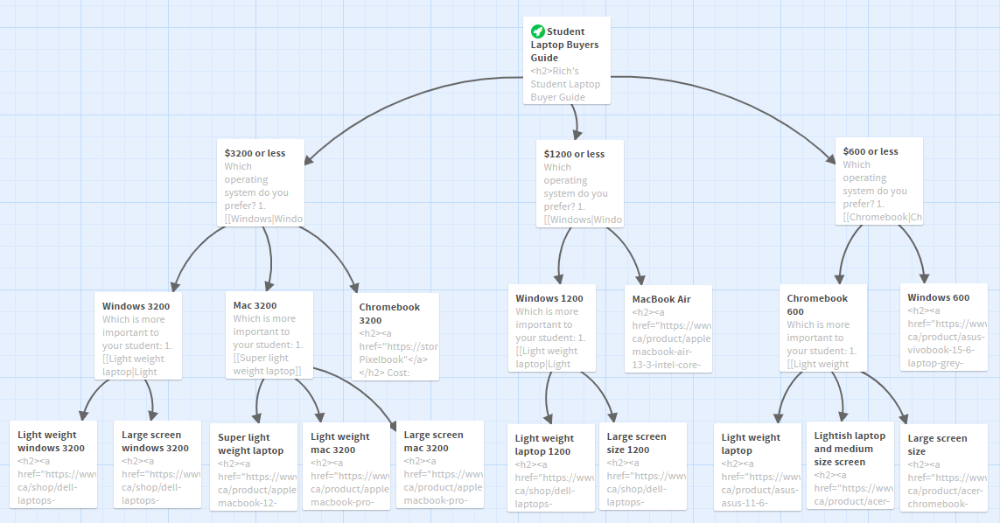

 
# Guided Interviews with Twine
If you have any questions or get stuck as you work through this in-class exercise, please ask the instructor for assistance.  Have fun!
Note: To avoid compatibility issues, on Macs please use Firefox or Chrome web browsers instead of Safari.
1. Create a new guided interview guide by navigating to [the Twine website](http://twinery.org/2/){:target="_blank"}   and clicking on the green “+ Story” button on the right-hand navigation bar. Give your guided interview a name something like, “Laptop Buyers Guide” which you can change later if you want.
2. You can create any guided interview you want,  but if you don’t have anything in mind, please feel free to use our sample [“Laptop Buyers Guide” interview](http://bit.ly/2KWhugt){:target="_blank"}
3. Double click on the “Untitled Passage” box on the screen and start importing your interview into Twine by copying and pasting the introductory text into the text box. Also title the passage, as this is key to linking different passages together. 
 
4. To create other passages, simply surround the text in the document with double square brackets, and this automatically creates another passage. E.g.: ```“1. [[$3200 or less]]” Give this a try now if you haven’t already. You will see the auto-generated passage similar to the image to the right when you close the current passage.```<br>

5. Go ahead and create all the other passages for your interview, by copy and pasting the text into passages as you just did above. 
6. Next please insert an image into one of your passages by typing or pasting the following HTML into the passage. If you would like to use your own image, paste the URL of your image in place of the URL below the quotation marks: ``````

7. Experiment with different text types formatting in a passage. 
  - Bold: This is done by putting two stars on either side of the text: ```**Bold text**```
  - Underline: Put the HTML tags for underline on either side of the text: ```<u>underline</u>```
  - Italicize: Put one star on either side of the text: ```*italicize text*```

8.  Change the background colour, font type and font colour of your story by clicking on the title of your story on the bottom left of the screen (in my case, “Laptop Buyers Guide”) and then click on “Edit Story Stylesheet.” Now type in the following code: 
```
tw-passage {
	font-family: arial;
  	color: black;
  	background-color: white;
	padding: 2em;
}
tw-icon {
	opacity: 1.0;
  	color: white;
}
tw-link {
	font-weight: normal;
}
```
9. It’s important to remember to save your interview fairly frequently as the story is being stored on your local hard drive. To do this, click on the title of your story on the bottom left of the screen (in my case, “Laptop Buyers Guide”) and then click on “Publish to File.”  This will save the story to your local hard drive, and then you can email it to yourself or save it to a thumb drive for safekeeping.
10. Try to upload your story to your personal UVic webspace. For directions on how to do this [look here](http://bit.ly/2QlRZo0){:target="_blank"} 
  - Note: If you are using your own images, they must be available somewhere on the web, or also uploaded to your webspace with the correct. The best practice is to upload them to your personal webspace as you develop your story so that you can make sure they work correctly as you go.

11. **Optional Bells and Whistles for your Interview (if you have time):**<br> Put URL links to other webpages or web resources into your story. E.g. ```<a href="http://google.com">Link text here.</a>```

12. Put URL links to other webpages or web resources into your story using an image as the link “button.” E.g. ```<a href="http://dell.com/"></a>```

13. Embed a YouTube video into one of your passages. Note in the code below how you need to modify the YouTube URL for this work by deleting the “watch?v=” from the URL and replacing it with “embed/” :
```<iframe width="560" height="315" src="https://www.youtube.com/embed/_JF0Jys5ITc" frameborder="0" allowfullscreen></iframe>```
14. Here is a more fully developed [example of a Laptop Buyers Guide](http://bit.ly/2Iv0kkz){:target="_blank"} 

[NEXT STEP: Using Variables](variables.html){: .btn .btn-blue }
