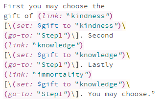
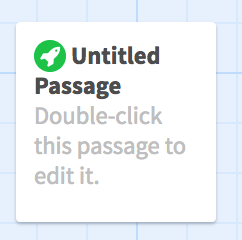
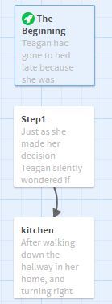
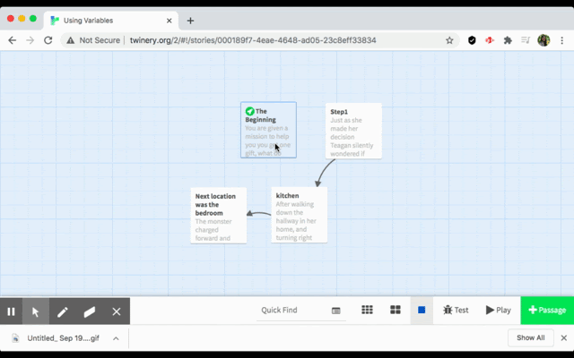

# Using Variables to keep track of selections without branching

If you have any questions or get stuck as you work through this in-class exercise, please ask the instructor for assistance. If you’d like to see an excellent example of a story that uses variables, please check out this [Poetry Escape story](https://web.uvic.ca/~rmccue/escape-room.html){:target="_blank"} , written by Karlie Castle, a UVic Education student. If you’d like to see how the story was made, ask your instructor how you can download a local copy of the story and look at it in Twine’s editor view. Have fun!  **Note**: To avoid compatibility issues, on Macs please use Firefox or Chrome web browsers instead of Safari.

1. Create a new story by navigating to [the Twine website](http://twinery.org/2/){:target="_blank"} and clicking on the “+ New” button on the top navigation bar. Give your story a name something like, “**Teagan’s Story**” (which you can change later if you want to).
2. Open your word processing document where you have your story laid,  or if you don’t have your own story you can use our sample [Teagan’s Story](http://bit.ly/2KQmbbq){:target="_blank"}  
3. Double click on the “**Untitled Passage**” box on the screen and start importing your story into Twine by copying and pasting the first passage of text into the text box. Also title the passage, as this is key to linking different passages together. 
4.  Note the format in the text you just pasted into the passage that will allow you to save and access some text for use or reference later in the story. For example: 
```(link: "kindness")[\(set: $gift to "kindness")\(go-to: "Step1")\]```
- The link text displayed in the passage is: “**kindness**”
- The variable or text holder is **$gift**, and the value or text it is storing, in this case, is “**kindness**”. 
- When this link is clicked, it will take the reader to the “**Step1**” passage.
5. Note that for each of the other related variable links below that the variable or holder in all three cases is **$gift** and the goto passage in all three cases is “**Step1**”, only the value being assigned or set is different:
- ```(link: "knowledge")[\(set: $gift to "knowledge")\(go-to: "Step1")\]```
- ```(link: "immortality")[\(set: $gift to "immortality")\(go-to: "Step1")\]```

6. To add a gift option, you could copy/paste the command in Step 4 and change the link and variable like this:
- ```(link: “bravery")[\(set: $gift to "bravery")\(go-to: "Step1")\]```

7. To check the **$gift** variable in a later passage and then present different options based on the value of the **$gift**, you can use the following code:
```The monster charged forward and then (if: $gift is "knowledge") [unfortunately your (print: $gift) was not able to help you and you die.] (else:) [your gift of (print: $gift) saved you from the dragon!]```

8. Go ahead and create all the other passages for your story, by either writing it yourself or copy and pasting the text into passages as you just did above for the sample story.
9. Try to upload your story to your personal UVic webspace. For directions on how to do this [look here](http://bit.ly/2QlRZo0){:target="_blank"} 

10. **Extra Credit Activities (if you have time)**:
11. Text input into a variable, for readers to input names for example:
```(put: (prompt: "What's your name?","") into $name) Your name is $name.```
12. Add a countdown timer
- In the Start passage, press Enter twice and then copy/paste the following code from variable-demo.txt after “It is up to you to choose”:
```
{(set: $counter to 10)
You have |amount>[$counter] seconds left!
(live: 1s)[
	(set: $counter to it - 1)
	(if: $counter is 0)[(go-to: "Step1")]
	(replace: ?amount)[$counter]
]}
```
- Play/test the passage. Now we only have 10 seconds to choose a gift before we are automatically taken to “Step1.”
       - We **set** a variable (named counter) to 10.
       - Next, we create a **hook** named **amount**, which has the same value as **$counter**. A hook is a snippet of text that we mark as special, usually because we want to manipulate it in some way (e.g. change the style).
       - **(live: 1s)[...]** means Twine repeats these commands every second:
            - decrease $counter by 1
            - if the timer runs out, go to “Step1”
            - Update **amount** with the new value of the counter.

13. If the timer runs out, we could update “Step1” to reflect that. Replace all the text in Step1 with the following from variable-demo.txt:

```(if: $counter is 0)[Teagan was paralyzed with indecision. She wondered what could have happened if she'd only chosen something -- anything!]\```

```(else:)[Just as she made her decision Teagan silently wondered if choosing <b>(print: $gift)</b> had been the best decision.]\```

```As she pondered, the light quickly and steadily became smaller and smaller until it disappeared altogether.```

```What to do now? Unable to sleep anymore, Teagan climbed out of bed, opened her bedroom door and headed to the [[kitchen]].```

- Now if **$counter** runs out (i.e. reaches 0), Twine will display the first sentence “Teagan was paralyzed…” Otherwise, Twine will display everything as before.

14. What if we want to randomly pick a gift instead? We could replace the first sentence in “Step1” with this from variable-demo.txt:
```(if: $counter is 0)[(set: $gift to (either: "kindness", "knowledge", "immortality"))Teagan randomly chose <b>(print: $gift)</b>.]\```
- ```(either:…) tells Twine to randomly pick from a list of options.```

[NEXT STEP: Publish with GitHub Pages](github.html){: .btn .btn-blue }
